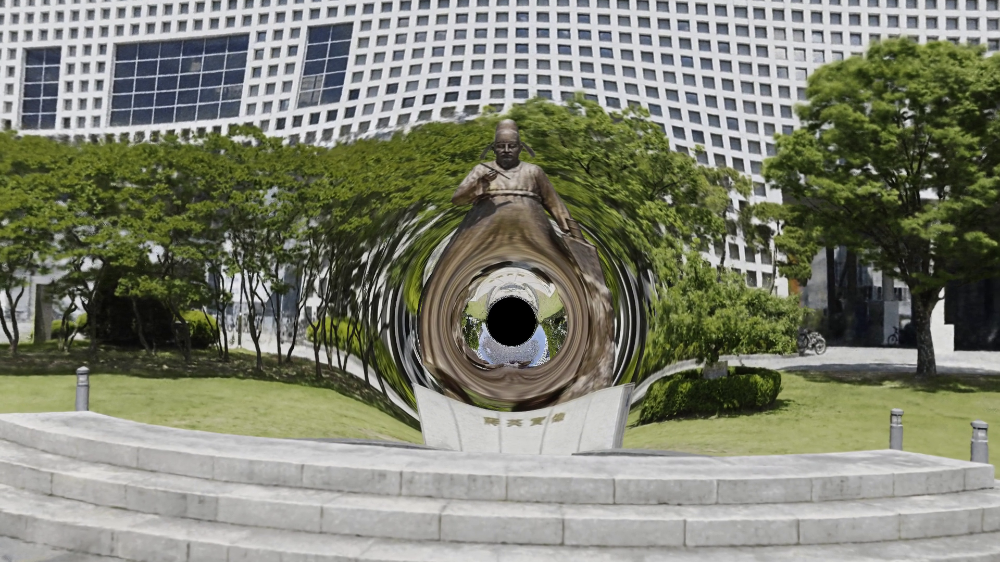

# Black-hole gravitational lensing in a reconstructed 3D scene

Drop a Schwarzschild black hole into a real, photographed scene and render the
gravitational lensing **physically** — every camera ray is integrated as a curved
null geodesic and the scene's radiance field is sampled along the bent path. The
result is a black shadow with the surrounding scene smeared and arced around it,
composited seamlessly into the actual reconstruction.

The scene is reconstructed with [nerfstudio](https://docs.nerf.studio); the radiance
field is **nerfacto**. (3D Gaussian Splatting is used only for a fast live preview —
splatting rasterizes straight rays and so cannot bend light; the lensing itself is
done by ray-marching the continuous NeRF field.)

## Demo

A Schwarzschild black hole appears over the 장영실 (Jang Yeong-sil) statue plaza and grows,
lensing the whole scene — rendered entirely with the curved-geodesic NeRF renderer in this
repo (1080p, 10 s):

https://github.com/seyoonp1/3d-gaussian-splatting-with-gravity-lens/raw/main/assets/demo_blackhole.mp4

(If the inline player doesn't load, [download the video](assets/demo_blackhole.mp4); a still
frame is shown below.)



## How it works

Three renderers share one coordinate frame (OpenCV `c2w`, the same one gsplat and
nerfacto's ColmapDataParser use), so everything lines up pixel-for-pixel:

| Mode | Renderer | Use |
|------|----------|-----|
| **Live preview** | gsplat rasterization of the `.ply` | fast orbiting in the browser |
| **📸 Snapshot** (`r_s = 0`) | nerfacto native proposal sampling | clean reference render |
| **Black hole** (`r_s > 0`) | curved-geodesic march through the nerfacto field | the lensing effect |

**Why two representations?** It's purely a speed split. gsplat rasterizes in real
time, so it drives the **live preview** — you orbit the scene and drag the black hole
around smoothly at interactive frame rates. The actual output (snapshot, black hole,
video) is rendered with **nerfacto**: a black hole needs a continuous field to sample
along curved rays, and nerfacto also looks cleaner — but rendering it takes seconds per
frame, far too slow to fly around in. So gsplat is used *only* for the preview, and
nerfacto *only* for the on-demand renders. Keeping both is cheap: a `splatfacto` model
for the preview trains quickly (much faster than nerfacto), so the extra preview
representation costs very little.

**The black hole.** Photons follow Schwarzschild null geodesics, integrated in
Cartesian coordinates with RK4 (`geodesic.py`):

```
dp/dl = v
dv/dl = -(3/2) · r_s · h² · p / r⁵      h² = |p × v|²,  r = |p|
```

`r_s` (Schwarzschild radius) is the only physical knob; an artistic `strength`
multiplier lets you dial the bending up or down for a stylised look. Rays that reach
the **photon sphere** (`r < 1.5·r_s`) are doomed and get captured there, which gives
the physically-correct apparent shadow (critical impact parameter `b_crit ≈ 2.6·r_s`)
and keeps bright background from leaking into the shadow.

**Matching native quality.** A naive uniform march along the bent ray aliases thin
surfaces. Instead `curved_proposal.py` reproduces nerfacto's exact sampling cascade
(uniform 256 → proposal-net 0 → 96 → proposal-net 1 → 48 → main field), but along the
**bent polyline**: the proposal networks are queried as position→density functions on
arc-length-interpolated points, and the final samples are inverse-CDF (density-)
weighted just like the straight-ray native renderer. So lensed surfaces keep the same
detail as an unlensed nerfacto render.

## Repository layout (active pipeline)

```
blackhole/
  geodesic.py          Schwarzschild null-geodesic RK4 integrator (pure PyTorch)
  curved_proposal.py   native-equivalent proposal cascade along the bent polyline
  nerf_renderer.py     load nerfacto; render straight (native) or curved (black hole)
  ply_loader.py        load an ns-export gaussian-splat .ply for the gsplat preview
  viewer.py            interactive viser viewer (preview + snapshot + video)
  render_video_job.py  standalone detached video renderer (survives viewer/SSH drop)
  tests/test_geodesic.py   checks the integrator vs the weak-field Einstein angle
```

(`blackhole/_legacy/` holds an earlier gaussian-splatting ray-marcher that was
abandoned in favour of the NeRF field — kept locally, not part of the repo.)

## Setup

Everything installs from one file ([`requirements.txt`](requirements.txt)):

```bash
conda create -n blackhole python=3.10 -y && conda activate blackhole
export CUDA_HOME=$CONDA_PREFIX          # gsplat compiles a CUDA kernel on install
pip install -r requirements.txt
```

This pulls torch (CUDA 12.4 wheel), nerfstudio, gsplat, viser and nerfview — the whole
pipeline. To reconstruct your own scenes you also need the COLMAP binary, which is a
native package rather than a pip wheel: `conda install -c conda-forge colmap`.

## Usage

**1. Reconstruct a scene** (images or a video → COLMAP poses):

```bash
ns-process-data video --data my_capture.mp4 --output-dir data/myscene
ns-train nerfacto --data data/myscene
ns-train splatfacto --data data/myscene          # for the live preview
```

**2. Export the gaussian splat** for the preview:

```bash
ns-export gaussian-splat --load-config outputs/.../splatfacto/.../config.yml \
    --output-dir exports/myscene
```

**3. Launch the viewer** (`r_s` slider + draggable black-hole gizmo):

```bash
CUDA_HOME=$CONDA_PREFIX python blackhole/viewer.py \
    --ply exports/myscene/splat.ply \
    --config outputs/.../nerfacto/.../config.yml --share
```

## Viewer guide

Open the share URL printed at startup. You orbit the scene in real time (gsplat); a
draggable orange gizmo marks the black hole. Everything in the GUI panels on the right:

**Black hole**
- `r_s (size, 0=off)` — Schwarzschild radius. `0` = no black hole (plain render). Bigger
  = bigger shadow and stronger lensing. The orange ring overlaid on the live preview
  shows the apparent shadow size (`b_crit ≈ 2.6·r_s`).
- `lens strength` — artistic multiplier on the bending (1.0 = physically exact).
- Drag the gizmo to move the black hole anywhere in the scene.

**NeRF render**
- `resolution (width)` — output width (height is 16:9). The NeRF is continuous, so any
  resolution works; high res is fine for snapshots but slow for the curved black hole.
- `curved steps` — geodesic march resolution for the black hole. Higher = smoother
  lensing, slower.
- `supersample (curved)` — 2× anti-aliasing for the black hole (4× slower).

| Button | What it does | When to use |
|--------|--------------|-------------|
| **📸 Render snapshot (NeRF)** | Renders the current view with nerfacto. `r_s=0` → clean native render; `r_s>0` → the black hole. Saves a PNG and freezes it on screen. | the main "take a picture" button |
| **📊 Compare gsplat ↔ NeRF** | Side-by-side of the gsplat preview vs the native NeRF for this view. | sanity-check that preview and NeRF line up |
| **🔬 Compare native ↔ curved(rs=0)** | Native nerfstudio render vs our curved sampler at `r_s=0`. | verify the curved sampler matches native when there's no bending |
| **🎬 Render black-hole orbit video** | Auto-orbits the camera around the black hole and renders each frame (uses the `video frames` / `video orbit (deg)` sliders). Runs in-process. | a quick turntable around a fixed black hole |
| **🎬 Render black-hole video** *(keyframe panel)* | Renders along the **Rendering panel's** camera path with per-keyframe `r_s`. Launches a **detached** job. | a custom flythrough (see below) |

- `🖼 show last render (freeze)` keeps the last NeRF render full-screen instead of the
  live preview; moving the camera auto-unfreezes it.

**Recording a custom flythrough video**

1. Move the camera, set an `r_s`, and click **Add Keyframe** in nerfstudio's *Rendering*
   panel. The panel records the camera; the viewer records that keyframe's `r_s` (shown
   under "r_s per keyframe"). Repeat for 2+ keyframes — `r_s` is interpolated between
   them, so the black hole can grow/shrink along the path.
2. Set the clip's FPS and Duration in the Rendering panel (the video uses those).
3. Click **🎬 Render black-hole video**. It precomputes every frame (camera + `r_s`) and
   launches `render_video_job.py` as a **detached process** — the render keeps going and
   writes `renders/blackhole_video.mp4` even if you close the viewer or drop the SSH
   connection. (Progress: `tail -f /tmp/video_job.log`.)
